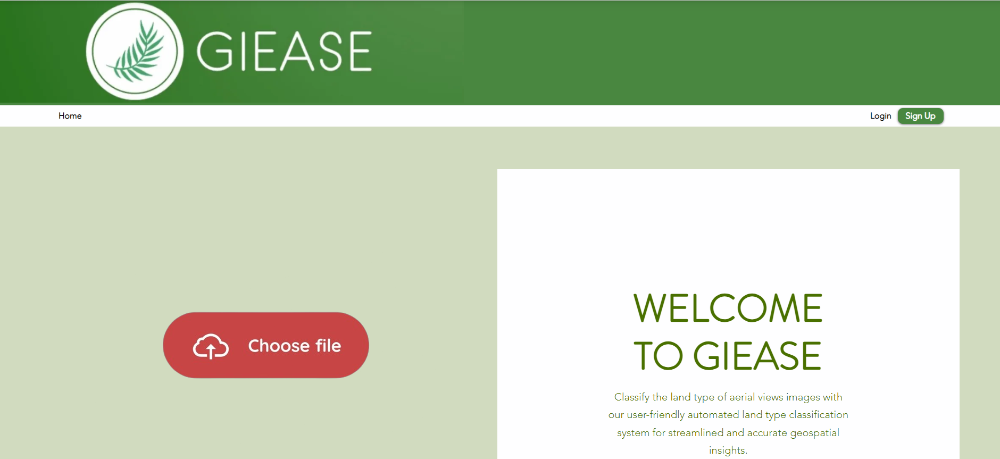

# GIEASE (Golden Eagle)
### A Web App with an automated GIS classification system underpinned by Region-based Convolutional Neural Network
### Target:  GE.A00.0
_______________________________________
# [Download Feature](https://github.com/rendznicoy/golden-eagle/blob//main/DOWNLOAD.md)
**Download Feature Preview**

**Upload**

This is used to allow users to upload the image.

**Input:**
* The user shall select an image from a folder.
  
**Process:**
+ The user shall select an image from a folder.
- The user uploads the image.

**Output:**
*  The image is validated and the user is prompted with the result.

**Data Dictionary**
| Element ID | Element Text      | Element Type | Data Type                | Required?          | Rules         |
|----------|------------|-------------------|----------------------------|-------------------------|----------------------|
| UploadButton      | Upload        | Button               | ...               | Yes               | To upload an image, the user must be logged in               | 
| ImageUpload      | Image Upload       | File Upload               | Image File               | Yes               | Select an aerial view image for classification               |

# [Upload Feature](https://github.com/rendznicoy/golden-eagle/blob//main/UPLOAD.md)

# [Login Feature](https://github.com/rendznicoy/golden-eagle/blob//main/LOGIN.md)

# [Revisions](https://github.com/rendznicoy/golden-eagle/blob//main/REVISIONS.md)

# [Homepage](https://github.com/rendznicoy/golden-eagle/blob/main/HOMEPAGE.md)

# [Sign Up Feature](https://github.com/rendznicoy/golden-eagle/blob//main/SIGNUP.md)

